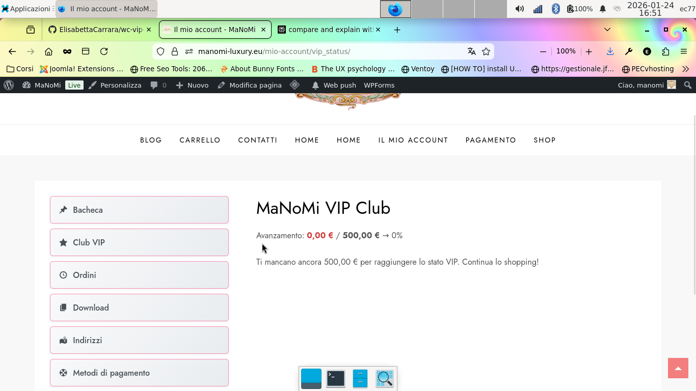
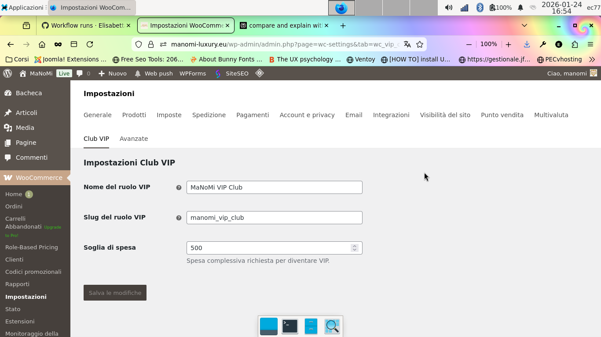

WC VIP Club
=======================

**Plugin Name:** WC VIP Club  
**Plugin URI:** https://elica-webservices.it  
**Description:** Automatic VIP role assignment based on customer lifetime spending in Woo.  
**Version:** 1.2.0  
**Requires at least:** 4.9.15  
**Requires PHP:** 8.2  
**Author:** Elisabetta Carrara  
**Author URI:** https://elica-webservices.it  
**License:** GPL v2 or later  
**License URI:** https://www.gnu.org/licenses/gpl-2.0.html  
**Text Domain:** wc-vip-club  
**Domain Path:** /languages  
**Tested up to:** 6.6  
**Requires Plugins:** woocommerce  
**WC requires at least:** 6.0  
**WC tested up to:** 9.5  
**Tags:** woocommerce, vip, customer-loyalty, roles, membership  
**Update URI:** https://elica-webservices.it

**Automatic VIP role assignment based on customer lifetime spending in WooCommerce.**

WC VIP Club monitors customer spending and automatically upgrades your most loyal shoppers to a VIP role. It provides a visual progress tracker in the "My Account" area, gamifying the shopping experience to encourage repeat purchases.

---

## 📖 User Guide: How it Works

### 1. Admin Setup (Store Owner)
Once installed, configuring your VIP program takes less than a minute:
1. Navigate to **WooCommerce > Settings > VIP Club**.
2. **VIP Role Name:** Enter the name your customers will see (e.g., "Gold Member" or "Elite VIP"). The plugin will automatically create this role for you.
3. **Spending Threshold:** Set the total amount (in your store's currency) a customer must spend to earn the role.
4. **Role Slug (Optional):** Advanced users can set a custom database ID for the role.

### 2. The Customer Experience
The plugin creates a new **VIP Club** tab in the standard WooCommerce "My Account" dashboard.
- **Progress Tracking:** Customers see a visual progress bar showing how close they are to reaching VIP status.
- **Spending Data:** It clearly displays their current lifetime spend versus the required goal.
- **Status Confirmation:** Once the threshold is met, the progress bar is replaced with a success message confirming their new status.

### 3. Automatic Promotion
The "magic" happens in the background. When a customer's order is marked as **Processing** or **Completed**, the plugin recalculates their total spend. If they hit your target, their user role is instantly updated. 

*Note: The plugin only upgrades users; it never automatically removes the VIP role if spending decreases (e.g., via refunds), allowing you to handle downgrades manually or via hooks.*

### 4. Screenshots

---

## 🚀 Key Features
- **Zero Configuration Role Creation:** The plugin handles the technical creation of the WordPress role for you.
- **Theme-Safe Styles:** The progress bar and star icons use lightweight CSS that adapts to your theme's colors.
- **Multisite Ready:** Works perfectly in WordPress multisite environments.
- **Modern Standards:** Fully built for PHP 8.2+ and compliant with WordPress Coding Standards (WPCS).

## 🛠 Technical Standards
- **Strict Typing:** Uses PHP 8.2+ features like property types and return types.
- **Security First:** Implemented with late-escaping, sanitization, and strict nonce verification.
- **Extensible:** Designed with clean logic to allow developers to attach custom functionality.

## 📦 Installation
1. Download the latest [release](https://github.com/ElisabettaCarrara/wc-vip-club/releases).
2. Upload the `wc-vip-club` folder to `/wp-content/plugins/`.
3. Activate the plugin in WordPress.

## 🪝 Developer Hooks

### Filters
| Filter | Description |
| :--- | :--- |
| `vip_club_role_name` | Modify the display name of the VIP role. |
| `vip_club_role_slug` | Modify the slug used for the role. |
| `vip_club_threshold` | Dynamically change the spending threshold. |

### Actions
| Action | Description |
| :--- | :--- |
| `vip_club_role_synced` | Fires after the VIP role is updated in the database. |
| `vip_club_customer_promoted` | Fires when a customer hits the threshold and is upgraded. |

## 📜 Changelog

### 1.2.0 (Jan 2026)
- **Refactor:** Full compliance with WordPress Coding Standards (WPCS).
- **PHP Update:** Added explicit return types and strict typing for PHP 8.2.
- **Improvement:** Improved documentation and added `.gitattributes` for cleaner releases.

### 1.1.0
- Added role slug override option.
- Initial My Account tab logic.

### 1.0.0
- Initial release.

---
Developed with ❤️ by [Elisabetta Carrara](https://elica-webservices.it).
